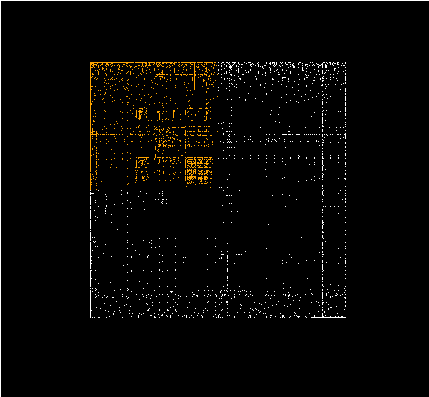
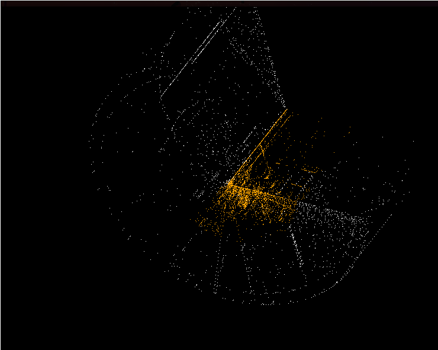

# Final Project Description

__Zane Lyle and William Setzer__

## Goal

To visualize binary files for the purpose of reverse engineering.
Binary files are typically viewed as opcodes or a flowchart in a debugger or decompiler such as IDA.
Viewing files in this way requires significant time for even seasoned reverse engineering professionals because of the effort required to parse small parts of the program at a time.
Instead of looking at a binary at such a granular level, we aim to improve the ability of reverse engineers to examine a file as a whole by representing a binary file in a variety of ways.

Depending on the chosen view, a user can represent the bytes of the binary using a variety of coordinate systems in both 2D and 3D.
Patterns in the data emerge depending on the chosen view and usage of the tool over time will lead to recognition of certain filetypes in the case of an obfuscated binary or certain classes of programs, as similar programs will display similar patterns.

{width=300}

{width=300}

